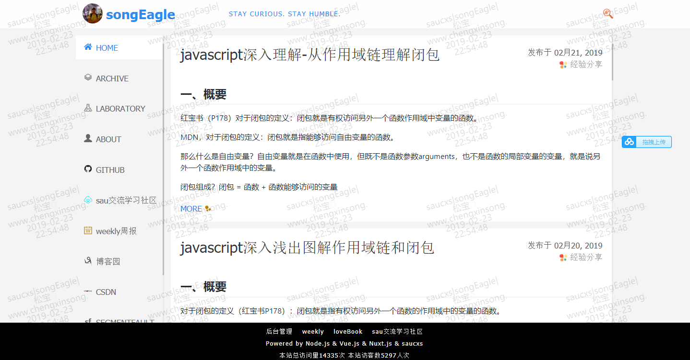
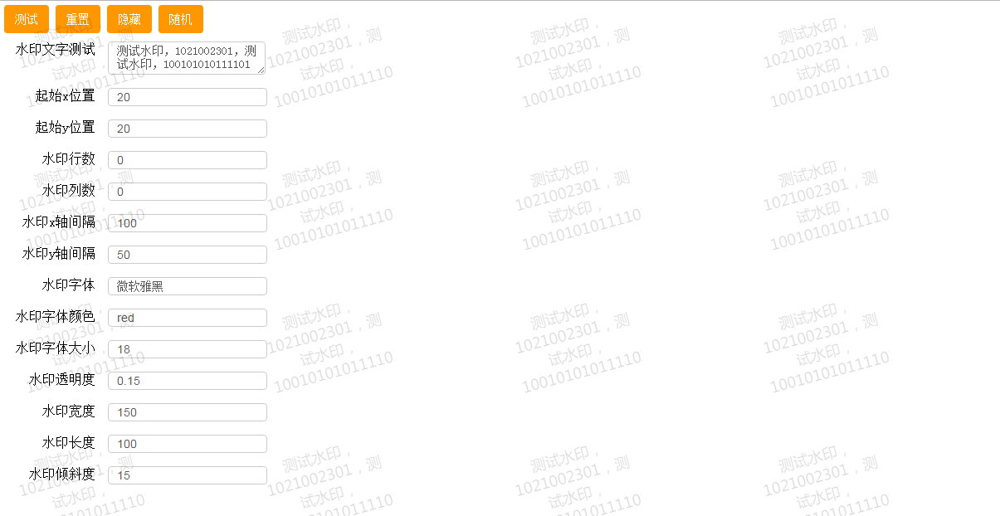

# [watermark](https://github.com/saucxs/watermark)
[](https://github.com/saucxs/watermark)
[](https://github.com/saucxs/watermark/blob/master/LICENSE)
[](https://github.com/saucxs/watermark/stargazers)
[](https://github.com/saucxs/watermark/network)
[](https://github.com/saucxs/watermark/issues)


`watermark.js`是一个给B/S网站系统加一个很浅的水印插件，确保系统的保密性，安全性，降低数据泄密风险。

水印插件内容，包含1、水印插件-使用，2、水印插件-testTool（测试工具），3、API介绍，4、支持浏览器

注意：基于本项目源码从事科研、论文、系统开发，"最好"在文中或系统中表明来自于本项目的内容和创意，否则所有贡献者可能会鄙视你和你的项目。 使用本项目源码请尊重程序员职业和劳动

## 1、水印插件-使用

### 1.1 本地引入封装的js文件

只是简单的加一个很浅的水印，实现起来很容易。不需要引入jquery插件。

`watermark.js`是必须要引进的组件

第一步：获取组件方式：`git clone https://github.com/saucxs/watermark.git`

第二步：clone后，在需要加水印的相关页面引入水印文件"watermark.js":
```
        script type="text/javascript" src="./watermark/watermark.js"></script>
```

第三步：在确保页面DOM加载完毕之后，调用watermark的load方法:
```
        <!--watermark start-->
        		  <script>watermark.load({ watermark_txt: "测试水印，1021002301，测试水印，100101010111101" })</script>
         <!--watermark end-->
```

使用插件的效果地址1：http://www.chengxinsong.cn

使用插件的效果地址2：https://www.mwcxs.top/static/mybs/sinaweibo/index.html




获取一个watermark_demo1的源码（watermark_demo1文件夹）

### 1.2 npm包引入
第一步：npm获取水印组件包： 
````
npm install watermark-dom
````
第二步：引入水印模块：
````
import watermark from 'watermark-dom'
或者
var watermarkDom = require("watermark-dom")
````
第三步：在需要使用水印的页面js中调用水印初始化方法
````
watermark.init({ watermark_txt: "测试水印"});
````


## 2、水印插件-testTool（测试工具）

获取方式：`git clone https://github.com/saucxs/watermark.git`

用浏览器打开index.html

查看地址：https://www.mwcxs.top/static/testTool/index.html

看到水印插件-测试demo的效果



## 3、API介绍
    
 格式：[请求类型:]URL地址
 
 例如：
 
     get:/api/watermark    //获取水印参数
     post:/api/watermark   //发布水印参数
     put:/api/watermark    //更新水印参数
     delete:/api/watermark   //删除水印参数
     
 PS：如果没有添加请求类型的话，默认为get请求。
 
 返回结果定义：
 
 返回结果根据不同的状态需要定义，返回结果`<<<`标识，例如：
 
    <<<
    success
    {
        "errNum":0,
        "retMsg":"success",
        "retData":{
              "watermark_txt":"测试水印",
              "watermark_x":20,//水印起始位置x轴坐标
              "watermark_y":20,//水印起始位置Y轴坐标
              "watermark_rows":0,//水印行数
              "watermark_cols":0,//水印列数
              "watermark_x_space":100,//水印x轴间隔
              "watermark_y_space":50,//水印y轴间隔
              "watermark_font":'微软雅黑',//水印字体
              "watermark_color":'black',//水印字体颜色
              "watermark_fontsize":'18px',//水印字体大小
              "watermark_alpha":0.15,//水印透明度，要求设置在大于等于0.003
              "watermark_width":150,//水印宽度
              "watermark_height":100,//水印长度
              "watermark_angle":15,//水印倾斜度数
        }
    }
    <<<
    error
    {
        "errNum":0,
        "retMsg":"success",
        "retData":[]
    }

## 4、支持浏览器
Chrome,FireFox,IE6、7、8、9、10、11浏览器（鼠标事件向下传导，不支持select控件）
IE6、7、8不支持旋转
